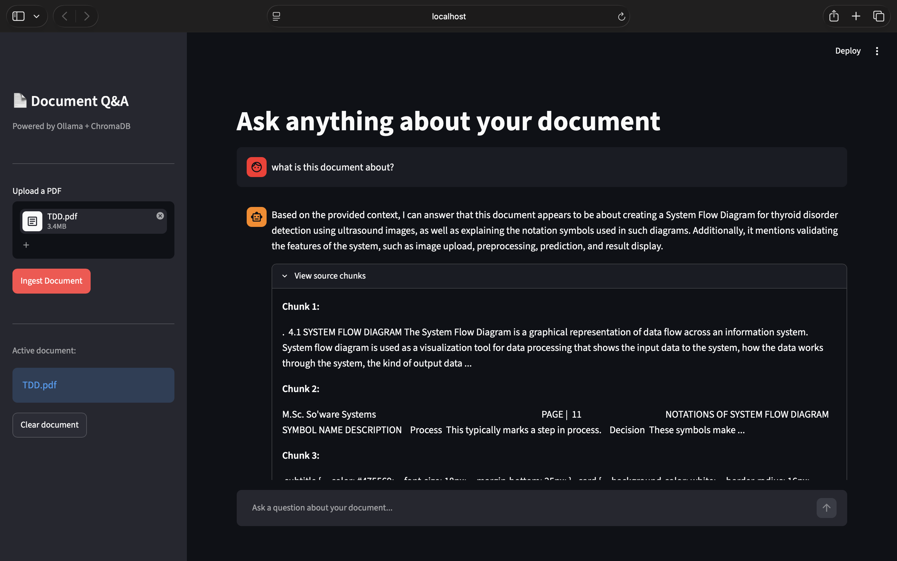

# AI Document Q&A Tool 📄

An AI-powered document Q&A tool that lets you upload any PDF and ask questions about it using a fully local RAG (Retrieval-Augmented Generation) pipeline — no API keys, no cloud, no cost.

---

## Demo



---

## Features

- Upload any PDF and ask questions in a chat interface
- **Fully local** — runs on your machine using Ollama (no OpenAI API needed)
- **RAG pipeline** — retrieves relevant chunks before generating answers
- **Source citations** — shows exactly which parts of the document were used
- **FastAPI backend** — clean REST API with auto-generated docs at `/docs`
- **Streamlit frontend** — chat UI with session history and expandable sources
- **ChromaDB vector store** — persistent embeddings across sessions
- **Multi-document support** — ingest multiple PDFs, each gets its own collection

---

## Tech Stack

| Tool | Purpose |
|---|---|
| Python 3.10 | Core language |
| Ollama (llama3) | Local LLM for answer generation |
| Ollama (nomic-embed-text) | Local embedding model |
| LangChain | Text splitting utilities |
| ChromaDB | Local vector database |
| PyPDF2 | PDF text extraction |
| FastAPI | REST API backend |
| Streamlit | Chat UI frontend |
| pytest | Automated testing |

---

## Project Structure

```
doc-qa/
├── ingestor.py      # PDF loading, chunking, embedding, ChromaDB storage
├── retriever.py     # Semantic search over ChromaDB
├── qa_chain.py      # Prompt building + Ollama LLM call
├── api.py           # FastAPI endpoints (/upload, /ask)
├── app.py           # Streamlit chat UI
├── tests/
│   ├── test_ingestor.py
│   └── test_qa_chain.py
├── DECISIONS.md     # Architecture decisions explained
├── .env.example
├── .gitignore
└── requirements.txt
```

---

## Setup

### Prerequisites
- Python 3.10
- [Ollama](https://ollama.com) installed and running

### 1. Pull required models
```bash
ollama pull llama3
ollama pull nomic-embed-text
```

### 2. Clone and install
```bash
git clone https://github.com/sujay-16/doc-qa.git
cd doc-qa
python3.10 -m venv venv310
source venv310/bin/activate
pip install -r requirements.txt
```

### 3. Configure environment
```bash
cp .env.example .env
```

---

## Usage

### Start Ollama (keep running in background)
```bash
ollama serve
```

### Start the API
```bash
uvicorn api:app --reload
```
API docs available at `http://localhost:8000/docs`

### Start the UI (new terminal tab)
```bash
source venv310/bin/activate
streamlit run app.py
```
Opens at `http://localhost:8501`

### Or use the CLI directly
```bash
# Ingest a PDF
python ingestor.py "your_document.pdf"

# Ask a question
python qa_chain.py "<collection_name>" "What is this document about?"
```

---

## How the RAG Pipeline Works

```
User uploads PDF
      ↓
ingestor.py
  → Extract text with PyPDF2
  → Split into 500-char chunks with 50-char overlap (LangChain)
  → Embed each chunk with nomic-embed-text (Ollama)
  → Store embeddings in ChromaDB (persisted to disk)
      ↓
User asks a question
      ↓
retriever.py
  → Embed the question with nomic-embed-text
  → Find top 4 most similar chunks in ChromaDB (cosine similarity)
      ↓
qa_chain.py
  → Build prompt: "Answer based only on this context: [chunks]. Question: [question]"
  → Send to llama3 via Ollama
  → Return answer + source chunks
      ↓
Streamlit UI displays answer with expandable source citations
```

---

## API Endpoints

### `POST /upload`
Upload a PDF for ingestion.
```bash
curl -X POST http://localhost:8000/upload \
  -F "file=@document.pdf"
```
Response:
```json
{
  "message": "PDF ingested successfully",
  "filename": "document.pdf",
  "collection_name": "document_pdf_a1b2c3d4"
}
```

### `POST /ask`
Ask a question about an ingested document.
```bash
curl -X POST http://localhost:8000/ask \
  -H "Content-Type: application/json" \
  -d '{"question": "What is this about?", "collection_name": "document_pdf_a1b2c3d4"}'
```

---

## Running Tests
```bash
pytest tests/ -v
```

---

## Resume Bullet Point

> *"Built a fully local AI document Q&A tool using a RAG pipeline — PDF ingestion with PyPDF2, text chunking with LangChain, semantic embeddings with Ollama (nomic-embed-text), vector storage in ChromaDB, answer generation with llama3, exposed via a FastAPI REST API, and a Streamlit chat UI with source citations"*

---

## Author

**Sujay R** — [github.com/sujay-16](https://github.com/sujay-16)
